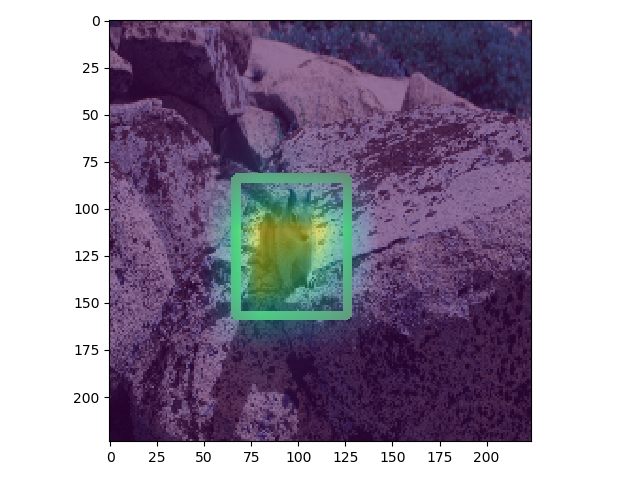
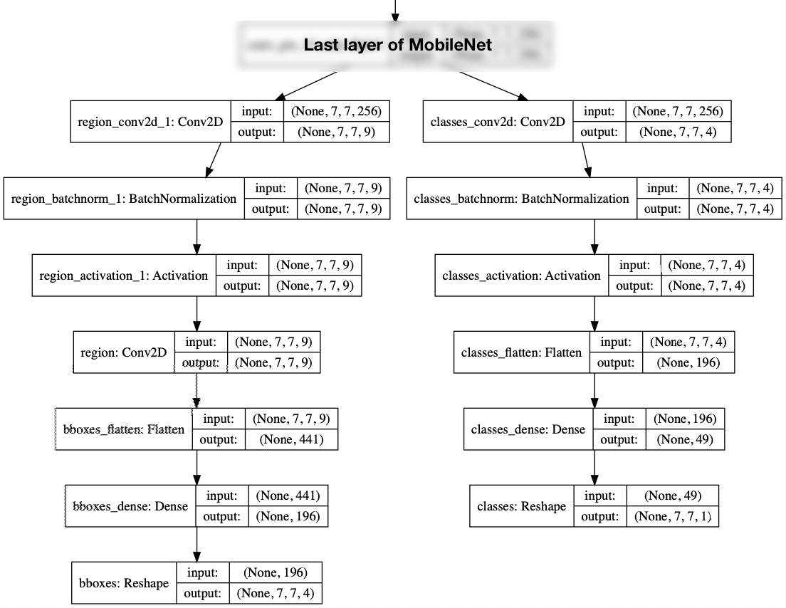

# Keras MobileDetectNet



MobileDetectNet is an object detector which uses [MobileNet][mobilenet] CNN to predict bounding boxes. It was designed to be computationally efficient for deployment on embedded systems and easy to train with limited data. It was inspired by the simple yet effective design of [DetectNet][detectnet] and enhanced with the anchor system from [Faster R-CNN][faster-r-cnn]. 

### Network Arcitecture


### Training

`python train.py --help`

#### Label Format
MobileDetectNet uses the KITTI label format and directory structure. See [here for more details][kitti]

#### Preprocessing
Images are scaled between -1 and 1 to take advantage of transfer learning from pretrained MobileNet.

#### Anchors
MobileNet outputs a 7x7x256 from its last layer with a 224x224x3 input. In each of the 7x7 squares we place 9 anchors with combinations of the following settings:

- Scale 1, 2, and 3
- Aspect Ratio 1, 4/3, and 3/4

We set the anchor to 1 if a rectangle has > 0.3 IoU with the anchor. The bounding box generated is given to the box with the highest IoU over 0.3.

Due to the smaller network receptive size and low spacial dimension output of MobileNet, anchors partially outside the image can be used.

#### Augmentation

`python3 test_augment.py --help`

Training is done with [imgaug][imgaug] utilizing Keras [Sequences][sequence] for multicore preprocessing and online data augmentation:

```python
return iaa.Sequential([
    iaa.Fliplr(0.5),
    iaa.CropAndPad(px=(0, 112), sample_independently=False),
    iaa.Affine(translate_percent={"x": (-0.4, 0.4), "y": (-0.4, 0.4)}),
    iaa.SomeOf((0, 3), [
        iaa.AddToHueAndSaturation((-10, 10)),
        iaa.Affine(scale={"x": (0.9, 1.1), "y": (0.9, 1.1)}),
        iaa.GaussianBlur(sigma=(0, 1.0)),
        iaa.AdditiveGaussianNoise(scale=0.05 * 255)
    ])
])
```

Data augmentation is also used for validation for the purpose of making sure smaller objects are detected. 
 
```python
return iaa.Sequential([
    iaa.CropAndPad(px=(0, 112), sample_independently=False),
    iaa.Affine(translate_percent={"x": (-0.4, 0.4), "y": (-0.4, 0.4)}),
])


```
 
If a dataset contains many smaller bounding boxes or detecting smaller objects is not a concern, this should be adjusted for both train and validation augmentation.

#### Loss
Standard loss functions are used for everything other than the bounding box regression, which uses `10*class_true_(ij)*|y_pred_(ij) - y_true_(ij)|` in order to not penalize the network for bounding box predictions without an object present and to normalize the loss against class loss. Class loss is binary crossentropy and region loss is mean absolute error.

#### Optimization
Nadam is the recomended optimizer. A base lr of 0.001 is used, and ReduceLROnPlateau callback reduces it during training. Generally the model should converge to an optimal solution within 50 epochs, depending on the amount of training data used.

### Inference

`python test_inference.py --help`

#### TensorRT

A TF-TRT helper function has been intergrated into the model which allows for easy inference acceleration on the [nVidia Jetson][jetson] platform. In model.py `MobileDetectNet.tftrt_engine()` will create a TensorRT accelerated Tensorflow graph. An example of how to use it is included in inference.py.

#### Performance

Using an FP16 TF-TRT graph the model runs at ~55 FPS on the Jetson Nano in mode 1 (5W). The performance doesn't seem to be effected running it in mode 0 (10W).

[mobilenet]: https://arxiv.org/abs/1704.04861
[imgaug]: https://github.com/aleju/imgaug
[sequence]: https://keras.io/utils/
[sgdr]: https://arxiv.org/abs/1608.03983
[kitti]: https://github.com/NVIDIA/DIGITS/tree/master/digits/extensions/data/objectDetection
[detectnet]: https://devblogs.nvidia.com/detectnet-deep-neural-network-object-detection-digits/
[faster-r-cnn]: https://arxiv.org/abs/1506.01497
[jetson]: https://developer.nvidia.com/embedded/buy/jetson-nano-devkit